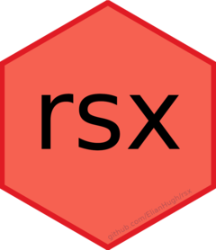

# rsx <a href="https://elianhugh.github.io/rsx/"></a>

<!-- badges: start -->
[](https://www.tidyverse.org/lifecycle/#experimental)
[](https://github.com/ElianHugh/rsx/actions)
[](https://app.codecov.io/gh/ElianHugh/rsx?branch=main)
<!-- badges: end -->

rsx is an R package for creating complex yet manageable Shiny applications with nestable components that encapsulate both UI and state. It is heavily inspired by many JavaScript frameworks, particularly Vue.

<b>Features</b>:

* Nestable and modular templating system
* Scoped CSS to isolate styles between components
* Automatic namespacing (think shiny modules)

## Why rsx?

When writing Shiny apps, managing the relationship between module server and module UI can be challenging, leading to cognitive overhead and confusion. With rsx, module servers and UI are always coupled under one object, simplifying the process of creating and managing Shiny modules.

## Installation

### Release build

``` r
install.packages('rsx', repos = 'https://elianhugh.r-universe.dev')
```

### Development build

``` r
# install.packages("devtools")
devtools::install_github("ElianHugh/rsx")
```

## Usage

To use rsx, you define your components as functions with the component function. Components can be composed of data, a template, styles, and methods, making them fully encapsulated and reusable. Once defined, you can use these components in your Shiny app with the rsx_app function.

```r
library(rsx)

counter <- component(
    name = "counter",
    data = function() {
        list(
            label = "Counter #1",
            count = reactiveVal(0L)
        )
    },
    template = function(ns) {
        tagList(
            actionButton(ns("button"), label = self$label),
            verbatimTextOutput(ns("out"))
        )
    },
    methods = list(
        setup = function(input, output, session) {
            observeEvent(input$button, {
                self$count(
                    self$count() + 1L
                )
            })
            output$out <- renderText(
                self$count()
            )
        }
    )
)

rsx_app(counter)
```

For more information on how to define and use components with rsx, please see the package documentation or the pkgdown site.